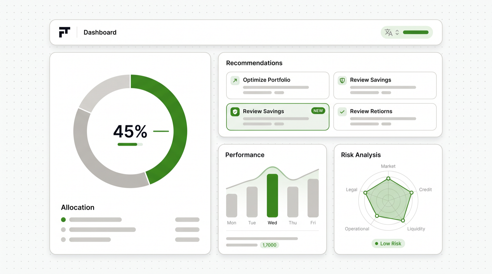

<a id="top"></a>

<p align="center">
  
</p>

<h1 align="center">MAIA System</h1>

<p align="center">
  <strong>M</strong>ulti-<strong>A</strong>gent <strong>I</strong>nvestment <strong>A</strong>nalysis — for Claude Code<br>
  Five specialized AI agents research crypto, stocks, forex &amp; commodities in parallel, adapt to your risk profile, and render an interactive, bilingual dashboard — <em>educational analysis, not financial advice.</em>
</p>

<p align="center">
  
  
  
  
  
  
</p>

<p align="center"><strong><a href="#espanol">Leer en Español ↓</a></strong> · by tododeia · <a href="https://github.com/Hainrixz">@soyenriquerocha</a></p>

---

> **What's new in v2.1** — hybrid **keyless** market-data APIs (CoinGecko · Yahoo Finance · Frankfurter) with optional premium keys, an educational acknowledgment gate, a security-hardened dashboard (CSP + XSS-safe HTML fallback), full accessibility (ARIA, keyboard nav, reduced-motion), a numeric data contract validated in CI, and portable runs from any directory. See the [CHANGELOG](CHANGELOG.md).

---

## What Is This?

MAIA is a **Claude Code skill** — a reusable prompt-and-tooling package that extends what Claude can do. When installed, Claude gains the ability to run a full multi-agent investment research workflow: 4 sector analysts research in parallel, a strategy agent synthesizes everything, and the result is served as an interactive dashboard in your browser.

## How It Works

```
                         ┌──────────────┐
                    ┌────┤  You trigger  ├────┐
                    │    │  "analyze     │    │
                    │    │   markets"    │    │
                    │    └──────────────┘    │
                    ▼                        ▼
            ┌──────────────┐        ┌──────────────┐
            │ Risk Profile │        │ Load History  │
            │   Question   │        │  (if exists)  │
            └──────┬───────┘        └──────┬───────┘
                   │                       │
                   ▼                       │
    ┌──────────────────────────────┐       │
    │     4 Sector Agents          │       │
    │  (parallel web research)     │       │
    │                              │       │
    │  ┌───────┐  ┌───────┐       │       │
    │  │Crypto │  │Stocks │       │       │
    │  └───────┘  └───────┘       │       │
    │  ┌───────┐  ┌──────────┐   │       │
    │  │ Forex │  │Materials │   │       │
    │  └───────┘  └──────────┘   │       │
    └──────────────┬───────────────┘       │
                   │                       │
                   ▼                       ▼
          ┌────────────────────────────────────┐
          │        Strategy Agent               │
          │  (cross-sector analysis,            │
          │   risk-adjusted ranking,            │
          │   portfolio allocation,             │
          │   historical accuracy check)        │
          └────────────────┬───────────────────┘
                           │
                    ┌──────┴──────┐
                    ▼             ▼
            ┌────────────┐ ┌────────────┐
            │ report.json│ │report-es   │
            │ (English)  │ │  .json     │
            └──────┬─────┘ └──────┬─────┘
                   │              │
                   ▼              ▼
              ┌──────────────────────┐
              │   Next.js Dashboard  │
              │   localhost:3420     │
              │   EN / ES toggle    │
              └──────────────────────┘
```

## Features

<p align="center">
  
</p>

- **5 AI agents** — 4 sector researchers + 1 strategy synthesizer, running in parallel
- **Hybrid market data** — authoritative prices from free **keyless** APIs (CoinGecko, Yahoo Finance, Frankfurter) with a deterministic fallback ladder; WebSearch adds news & sentiment. Optional `FINNHUB_API_KEY` / `POLYGON_API_KEY` for premium stock data
- **Dynamic asset discovery** — agents find the most relevant assets for current conditions instead of a fixed list
- **Risk profiles** — conservative / moderate / aggressive reshape scoring, illustrative position sizes, and allocation
- **Cross-sector strategy** — a synthesis agent surfaces correlations and divergences individual agents can't see
- **Historical accuracy tracking** — compares prior signals to outcomes over time (a local heuristic, not an audited record)
- **Interactive dashboard** — allocation donut, risk-vs-confidence and social-buzz charts, expandable per-asset tables, top-picks grid
- **Fully bilingual (EN/ES)** — UI *and* report data translate on toggle; numbers, tickers and prices stay intact
- **Educational-first compliance** — a one-time "not financial advice" gate before the report; analytical *Consider / Hold / Avoid* language instead of buy/sell
- **Accessible** — ARIA-labeled charts, keyboard-navigable cards & sortable tables, focus-visible rings, `prefers-reduced-motion`
- **Secure & private** — Content-Security-Policy + security headers; XSS-hardened HTML fallback; runs locally with data kept in `~/.claude/cache/tododeia`
- **Portable** — resolves its own install directory and writes to a writable cache, so it works from any folder
- **Scheduling** — optional daily or weekly recurring reports

## Sectors Covered

| Sector | Always Includes | Dynamically Discovers |
|--------|----------------|----------------------|
| Crypto | BTC, ETH | Trending altcoins, DeFi tokens, AI tokens |
| Stocks | S&P 500, NASDAQ | Top movers, catalyst-driven stocks across sectors |
| Forex | DXY, USD/MXN | Pairs affected by current events |
| Commodities | Gold, Oil WTI | Agricultural, energy, metals based on market conditions |

## Requirements

- [Claude Code](https://docs.anthropic.com/en/docs/claude-code) (CLI)
- Node.js 18+ for the interactive dashboard — **optional**; without it the skill renders a standalone HTML report (served with `python3`)
- An internet connection (agents fetch live prices and do web research)
- *Optional:* `FINNHUB_API_KEY` or `POLYGON_API_KEY` for premium stock data — free keyless sources are used by default

## Installation

### Option A: One-liner (fastest)

```bash
curl -sL https://raw.githubusercontent.com/Hainrixz/maia-skill/main/install.sh | bash
```

This clones the repo, symlinks the skill into Claude Code, and installs dashboard dependencies automatically.

### Option B: Claude Code plugin

```bash
claude plugin install Hainrixz/maia-skill
```

### Option C: Manual setup

```bash
# 1. Clone the repo
git clone https://github.com/Hainrixz/maia-skill.git

# 2. Symlink skill into Claude Code
mkdir -p ~/.claude/skills
ln -s "$(pwd)/maia-skill/.claude/skills/investment-analysis" ~/.claude/skills/investment-analysis

# 3. Install dashboard dependencies
npm install --prefix maia-skill/dashboard
```

The skill auto-activates when you mention investment-related topics in Claude Code.

## Usage

In any Claude Code conversation:

- "Run an investment analysis"
- "What are the best investment opportunities today?"
- "Analyze the markets"
- "Give me a market report"
- "Run tododeia"

You'll be asked your risk profile (conservative, moderate, or aggressive), then the 5 agents go to work. The report opens at `http://localhost:3420`. On first open you'll acknowledge a short *educational, not advice* notice and pick a language. Generated reports are written to `~/.claude/cache/tododeia` — not your current project folder.

### Language Toggle

<p align="center">
  
</p>

When you first open the dashboard, you'll be asked to pick English or Spanish. All report content — summaries, reasoning, news headlines, insights, warnings — translates to your chosen language. Numbers, prices, tickers, and percentages stay as-is. If a Spanish report isn't available yet, the dashboard shows English with a small notice instead of failing.

You can switch languages anytime from the toolbar.

### Scheduling (Optional)

After your first report, you can set up recurring analysis:

```
/loop 24h /investment-analysis    # Daily reports
/loop 168h /investment-analysis   # Weekly reports
```

## Project Structure

```
.claude/skills/investment-analysis/
  SKILL.md              # Skill definition (orchestrator instructions)
  assets/
    template.html       # Fallback HTML report (no Node.js)
  references/
    agent-prompts.md    # Prompts for all 5 agents
  dashboard/            # Next.js interactive dashboard
    src/
      app/              # App router pages
      components/       # Report UI components
      hooks/            # Language + data hooks
      lib/              # Translations, constants
      types/            # TypeScript types
    public/data/        # Sample report JSON (demo fixtures; live runs write to ~/.claude/cache/tododeia)
    schema/             # JSON Schema for the report data contract (CI-validated)
```

## Customization

### Assets & Agent Behavior

Edit `references/agent-prompts.md` to change which assets each agent researches, how they search, or what data they prioritize.

### Risk Profiles

The Strategy Agent prompt in `references/agent-prompts.md` defines how each risk profile affects scoring and allocation. Customize the multipliers and allocation ranges there.

### Dashboard Styling

The dashboard uses Tailwind CSS. Edit components in `dashboard/src/components/report/` to change the look and feel.

### Translations

Add or modify UI translations in `dashboard/src/lib/translations.ts`. Report data translation happens automatically via the translation agent (Step 8b in SKILL.md).

## Dashboard Features

- **Executive summary** with macro environment assessment
- **Portfolio allocation** chart with recommended percentages
- **Risk-adjusted top picks** grid with confidence scores and position sizing
- **Cross-sector insights** highlighting correlations between markets
- **Expandable sector panels** with detailed per-asset analysis
- **Charts**: allocation breakdown, risk vs. confidence visualization
- **Historical accuracy** tracking past recommendation performance
- **Risk warnings** when the strategy agent detects concerns
- **Full bilingual support** — English and Spanish, including all data

## Fallback Mode

If Node.js is not available, the skill falls back to a standalone `report.html` (in `~/.claude/cache/tododeia/output`) built from the template in `assets/`, served via Python's built-in HTTP server on port 8420 (`python3`, falling back to `python`). Report data is embedded as an inert JSON island and every web-sourced string is HTML-escaped, so untrusted headlines or posts can't inject scripts.

## Educational Use & Disclaimer

<p align="center">
  
</p>

Before the report renders, the dashboard shows a one-time acknowledgment ("this is educational, not financial advice") and the disclaimer stays visible at the top. Signals are phrased analytically (*Consider / Hold / Avoid*), never as buy/sell instructions.

**This is educational analysis, not financial advice.** MAIA's signals and allocations are AI-generated opinions derived from public data — they may be wrong, out of date, or incomplete, and are not a recommendation or solicitation to buy or sell any asset. AI analysis can contain errors. Always do your own research and consult a licensed financial advisor before investing. Past performance is not indicative of future results. **You assume all investment risk.**

**Data & limitations.** Prices come from free public APIs (CoinGecko, Yahoo Finance, Frankfurter) with a web-search fallback, so they may lag the market and some instruments fall back to search estimates. The "historical accuracy" metric is a local heuristic, not an audited track record. Set `FINNHUB_API_KEY` or `POLYGON_API_KEY` for higher-quality stock data (free keyless sources are used otherwise).

**Privacy.** Reports are generated and served on your machine only — runtime data is written to `~/.claude/cache/tododeia`, never committed to the repo. Do **not** expose the dashboard to the public internet; it has no authentication.

---

<a id="espanol"></a>

<p align="center">
  
</p>

<h1 align="center">MAIA System</h1>

<p align="center">
  <strong>M</strong>ulti-<strong>A</strong>gent <strong>I</strong>nvestment <strong>A</strong>nalysis — para Claude Code<br>
  Cinco agentes de IA especializados investigan crypto, acciones, forex y materias primas en paralelo, se adaptan a tu perfil de riesgo y renderizan un dashboard interactivo y bilingue — <em>analisis educativo, no asesoria financiera.</em>
</p>

<p align="center"><strong><a href="#top">Read in English ↑</a></strong> · por tododeia · <a href="https://github.com/Hainrixz">@soyenriquerocha</a></p>

---

> **Novedades v2.1** — APIs de mercado **sin clave** (CoinGecko · Yahoo Finance · Frankfurter) con claves premium opcionales, gate de reconocimiento educativo, dashboard endurecido (CSP + HTML de respaldo a prueba de XSS), accesibilidad completa (ARIA, teclado, movimiento reducido), contrato de datos numerico validado en CI, y ejecucion portatil desde cualquier carpeta. Ver el [CHANGELOG](CHANGELOG.md).

---

## Que es esto?

MAIA es un **skill de Claude Code** — un paquete reutilizable de prompts y herramientas que extiende lo que Claude puede hacer. Una vez instalado, Claude puede ejecutar un flujo completo de investigacion de inversiones con multiples agentes: 4 analistas sectoriales investigan en paralelo, un agente estrategico sintetiza todo, y el resultado se sirve como un dashboard interactivo en tu navegador.

## Como funciona

```
                         ┌──────────────┐
                    ┌────┤  Tu escribes  ├────┐
                    │    │  "analiza    │    │
                    │    │  mercados"   │    │
                    │    └──────────────┘    │
                    ▼                        ▼
            ┌──────────────┐        ┌──────────────┐
            │Perfil Riesgo │        │Cargar Histor.│
            │  Pregunta    │        │ (si existe)  │
            └──────┬───────┘        └──────┬───────┘
                   │                       │
                   ▼                       │
    ┌──────────────────────────────┐       │
    │     4 Agentes Sectoriales    │       │
    │  (investigacion en paralelo) │       │
    │                              │       │
    │  ┌───────┐  ┌──────────┐   │       │
    │  │Crypto │  │Acciones  │   │       │
    │  └───────┘  └──────────┘   │       │
    │  ┌───────┐  ┌──────────┐   │       │
    │  │ Forex │  │Mat.Primas│   │       │
    │  └───────┘  └──────────┘   │       │
    └──────────────┬───────────────┘       │
                   │                       │
                   ▼                       ▼
          ┌────────────────────────────────────┐
          │      Agente de Estrategia           │
          │  (analisis inter-sectorial,         │
          │   ranking ajustado por riesgo,      │
          │   asignacion de portafolio,         │
          │   verificacion de precision)        │
          └────────────────┬───────────────────┘
                           │
                    ┌──────┴──────┐
                    ▼             ▼
            ┌────────────┐ ┌────────────┐
            │ report.json│ │report-es   │
            │ (Ingles)   │ │  .json     │
            └──────┬─────┘ └──────┬─────┘
                   │              │
                   ▼              ▼
              ┌──────────────────────┐
              │  Dashboard Next.js   │
              │   localhost:3420     │
              │   EN / ES toggle    │
              └──────────────────────┘
```

## Caracteristicas

<p align="center">
  
</p>

- **5 agentes IA** — 4 investigadores sectoriales + 1 sintetizador de estrategia, en paralelo
- **Datos de mercado hibridos** — precios autoritativos desde APIs **sin clave** (CoinGecko, Yahoo Finance, Frankfurter) con escalera de respaldo determinista; WebSearch aporta noticias y sentimiento. Claves opcionales `FINNHUB_API_KEY` / `POLYGON_API_KEY` para datos premium de acciones
- **Descubrimiento dinamico** — encuentran los activos mas relevantes segun las condiciones actuales, no una lista fija
- **Perfiles de riesgo** — conservador / moderado / agresivo reconfiguran el scoring, los tamanos ilustrativos de posicion y la asignacion
- **Estrategia inter-sectorial** — un agente sintetizador revela correlaciones y divergencias que los agentes individuales no ven
- **Seguimiento de precision historica** — compara senales previas con resultados (heuristica local, no un historial auditado)
- **Dashboard interactivo** — dona de asignacion, graficos de riesgo y actividad social, tablas por activo expandibles, grid de top picks
- **Totalmente bilingue (EN/ES)** — interfaz *y* datos del reporte se traducen al cambiar idioma; numeros, tickers y precios intactos
- **Cumplimiento educativo primero** — gate de "no es asesoria financiera" antes del reporte; lenguaje analitico *Considerar / Mantener / Evitar* en vez de comprar/vender
- **Accesible** — graficos con ARIA, tarjetas y tablas operables por teclado, anillos de foco visibles, `prefers-reduced-motion`
- **Seguro y privado** — Content-Security-Policy + headers de seguridad; HTML de respaldo a prueba de XSS; corre localmente y los datos quedan en `~/.claude/cache/tododeia`
- **Portatil** — resuelve su propio directorio de instalacion y escribe en un cache, asi funciona desde cualquier carpeta
- **Programacion** — reportes recurrentes diarios o semanales opcionales

## Sectores Cubiertos

| Sector | Siempre Incluye | Descubre Dinamicamente |
|--------|----------------|----------------------|
| Crypto | BTC, ETH | Altcoins en tendencia, tokens DeFi, tokens IA |
| Acciones | S&P 500, NASDAQ | Mayores movimientos, acciones con catalizadores |
| Forex | DXY, USD/MXN | Pares afectados por eventos actuales |
| Materias Primas | Oro, Petroleo WTI | Agricolas, energia, metales segun condiciones |

## Requisitos

- [Claude Code](https://docs.anthropic.com/en/docs/claude-code) (CLI)
- Node.js 18+ para el dashboard interactivo — **opcional**; sin el, el skill genera un reporte HTML independiente (servido con `python3`)
- Conexion a internet (los agentes traen precios en vivo e investigan en la web)
- *Opcional:* `FINNHUB_API_KEY` o `POLYGON_API_KEY` para datos premium de acciones — por defecto se usan fuentes gratuitas sin clave

## Instalacion

### Opcion A: Una sola linea (la mas rapida)

```bash
curl -sL https://raw.githubusercontent.com/Hainrixz/maia-skill/main/install.sh | bash
```

Esto clona el repo, enlaza el skill a Claude Code e instala las dependencias del dashboard automaticamente.

### Opcion B: Plugin de Claude Code

```bash
claude plugin install Hainrixz/maia-skill
```

### Opcion C: Configuracion manual

```bash
# 1. Clonar el repo
git clone https://github.com/Hainrixz/maia-skill.git

# 2. Enlazar el skill en Claude Code
mkdir -p ~/.claude/skills
ln -s "$(pwd)/maia-skill/.claude/skills/investment-analysis" ~/.claude/skills/investment-analysis

# 3. Instalar dependencias del dashboard
npm install --prefix maia-skill/dashboard
```

El skill se activa automaticamente cuando mencionas temas de inversion en Claude Code.

## Uso

En cualquier conversacion de Claude Code:

- "Ejecuta un analisis de inversiones"
- "Cuales son las mejores oportunidades de inversion hoy?"
- "Analiza los mercados"
- "Dame un reporte de mercado"
- "Corre tododeia"

Se te preguntara tu perfil de riesgo (conservador, moderado o agresivo), luego los 5 agentes se ponen a trabajar. El reporte se abre en `http://localhost:3420`. Al abrirlo por primera vez reconoceras un breve aviso *educativo, no asesoria* y elegiras idioma. Los reportes generados se escriben en `~/.claude/cache/tododeia` — no en la carpeta de tu proyecto.

### Cambio de Idioma

<p align="center">
  
</p>

Cuando abras el dashboard por primera vez, se te pedira elegir ingles o espanol. Todo el contenido del reporte — resumenes, razonamientos, titulares, insights, advertencias — se traduce al idioma elegido. Los numeros, precios, tickers y porcentajes se mantienen igual. Si aun no hay reporte en espanol, el dashboard muestra ingles con un aviso en vez de fallar.

Puedes cambiar de idioma en cualquier momento desde la barra de herramientas.

### Programacion (Opcional)

Despues de tu primer reporte, puedes configurar analisis recurrentes:

```
/loop 24h /investment-analysis    # Reportes diarios
/loop 168h /investment-analysis   # Reportes semanales
```

## Estructura del Proyecto

```
.claude/skills/investment-analysis/
  SKILL.md              # Definicion del skill (instrucciones del orquestador)
  assets/
    template.html       # Reporte HTML de respaldo (sin Node.js)
  references/
    agent-prompts.md    # Prompts para los 5 agentes
  dashboard/            # Dashboard interactivo en Next.js
    src/
      app/              # Paginas del App Router
      components/       # Componentes del reporte
      hooks/            # Hooks de idioma y datos
      lib/              # Traducciones, constantes
      types/            # Tipos de TypeScript
    public/data/        # JSON del reporte generado (se crea en ejecucion)
```

## Personalizacion

### Activos y Comportamiento de Agentes

Edita `references/agent-prompts.md` para cambiar que activos investiga cada agente, como buscan, o que datos priorizan.

### Perfiles de Riesgo

El prompt del Agente de Estrategia en `references/agent-prompts.md` define como cada perfil de riesgo afecta la puntuacion y asignacion. Personaliza los multiplicadores y rangos de asignacion ahi.

### Estilos del Dashboard

El dashboard usa Tailwind CSS. Edita los componentes en `dashboard/src/components/report/` para cambiar la apariencia.

### Traducciones

Agrega o modifica traducciones de la interfaz en `dashboard/src/lib/translations.ts`. La traduccion de datos del reporte ocurre automaticamente a traves del agente de traduccion (Paso 8b en SKILL.md).

## Caracteristicas del Dashboard

- **Resumen ejecutivo** con evaluacion del entorno macro
- **Asignacion de portafolio** con porcentajes recomendados
- **Top picks ajustados por riesgo** con puntuaciones de confianza y tamano de posicion
- **Insights inter-sectoriales** destacando correlaciones entre mercados
- **Paneles sectoriales expandibles** con analisis detallado por activo
- **Graficos**: desglose de asignacion, visualizacion de riesgo vs. confianza
- **Precision historica** rastreando el rendimiento de recomendaciones pasadas
- **Alertas de riesgo** cuando el agente de estrategia detecta preocupaciones
- **Soporte bilingue completo** — ingles y espanol, incluyendo todos los datos

## Modo de Respaldo

Si Node.js no esta disponible, el skill genera un `report.html` independiente (en `~/.claude/cache/tododeia/output`) usando la plantilla en `assets/`, servido por el servidor HTTP de Python en el puerto 8420 (`python3`, con respaldo a `python`). Los datos del reporte se incrustan como un bloque JSON inerte y cada texto traido de la web se escapa, asi que titulares o publicaciones no confiables no pueden inyectar scripts.

## Uso Educativo y Aviso Legal

<p align="center">
  
</p>

Antes de renderizar el reporte, el dashboard muestra un reconocimiento unico ("esto es educativo, no asesoria financiera") y el aviso permanece visible arriba. Las senales se expresan de forma analitica (*Considerar / Mantener / Evitar*), nunca como instrucciones de comprar/vender.

**Esto es analisis educativo, no asesoria financiera.** Las senales y asignaciones de MAIA son opiniones generadas por IA a partir de datos publicos — pueden estar equivocadas, desactualizadas o incompletas, y no son una recomendacion ni solicitud para comprar o vender ningun activo. El analisis con IA puede contener errores. Haz siempre tu propia investigacion y consulta a un asesor financiero licenciado antes de invertir. El rendimiento pasado no es indicativo de resultados futuros. **Asumes todo el riesgo de inversion.**

**Datos y limitaciones.** Los precios provienen de APIs publicas gratuitas (CoinGecko, Yahoo Finance, Frankfurter) con respaldo de busqueda web, por lo que pueden ir por detras del mercado y algunos instrumentos recurren a estimaciones de busqueda. La "precision historica" es una heuristica local, no un historial auditado. Define `FINNHUB_API_KEY` o `POLYGON_API_KEY` para mejores datos de acciones (por defecto se usan fuentes gratuitas sin clave).

**Privacidad.** Los reportes se generan y sirven solo en tu maquina — los datos de ejecucion se escriben en `~/.claude/cache/tododeia`, nunca en el repo. **No** expongas el dashboard a internet publico; no tiene autenticacion.

## Licencia

MIT — ver [LICENSE](LICENSE)

## Contribuir

Codigo abierto. PRs son bienvenidos!
